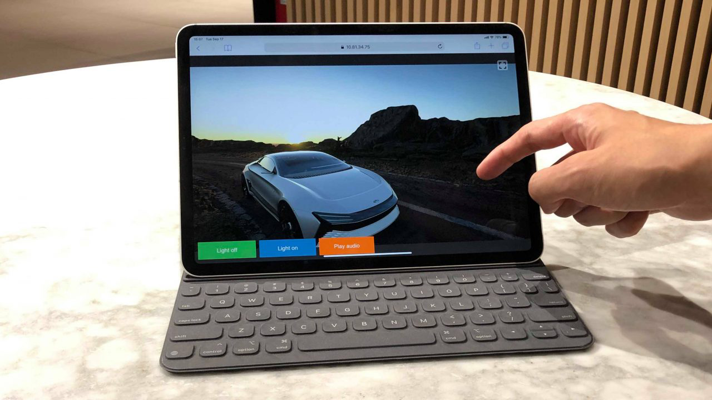
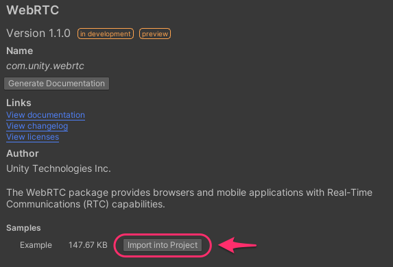

# WebRTC 



## What is WebRTC

WebRTC for Unity is a package that allows [WebRTC](https://webrtc.org) to be used in Unity.

## Requirements

This version of the package is compatible with the following versions of the Unity Editor:

- **Unity 2019.4**

| Platform    | Graphics API | Hardware Encoder                                                                                                         | Software Encoder   |
| ----------- | ------------ | ------------------------------------------------------------------------------------------------------------------------ | ------------------ |
| Windows x64 | DirectX11    | :white_check_mark: (Require [NVIDIA Graphics card](https://developer.nvidia.com/video-encode-decode-gpu-support-matrix)) | :white_check_mark: | 
| Windows x64 | DirectX12    | :white_check_mark: (Require [NVIDIA Graphics card](https://developer.nvidia.com/video-encode-decode-gpu-support-matrix)) | :white_check_mark: | 
| Windows x64 | OpenGL       |                                                                                                                          |                    |
| Windows x64 | Vulkan       |                                                                                                                          |                    | 
| Linux x64   | OpenGL       | :white_check_mark: (Require [NVIDIA Graphics card](https://developer.nvidia.com/video-encode-decode-gpu-support-matrix)) |                    |
| Linux x64   | Vulkan       |                                                 	                                                                        |                    |
| MacOS       | Metal        |                                                 	                                                                        | :white_check_mark: |

To check the compatible NVIDIA graphics card, please visit on the [NVIDIA VIDEO CODEC SDK web site](https://developer.nvidia.com/video-encode-decode-gpu-support-matrix#Encoder).

> [!NOTE]
> On Linux, `libc++1` `libc++abi1` packages should be installed.
> Please install like command below 
>
> ``` sudo apt install -y libc++1 libc++abi1 ```

## Installation

Please see [Install package](install.md).

## Samples

The package contains the following 3 samples. 

| Scene          | Details                                                  |
| -------------- | -------------------------------------------------------- |
| PeerConnection | A scene for checking the process of connecting to a peer |
| DataChannel    | A scene for sending and receiving text                   |
| MediaStream    | A scene for sending and receiving video/audio            |
| Stats          | A scene for checking the process of getting stats        |


To get these samples, Push the `Import into Project` button on Package Manager.

