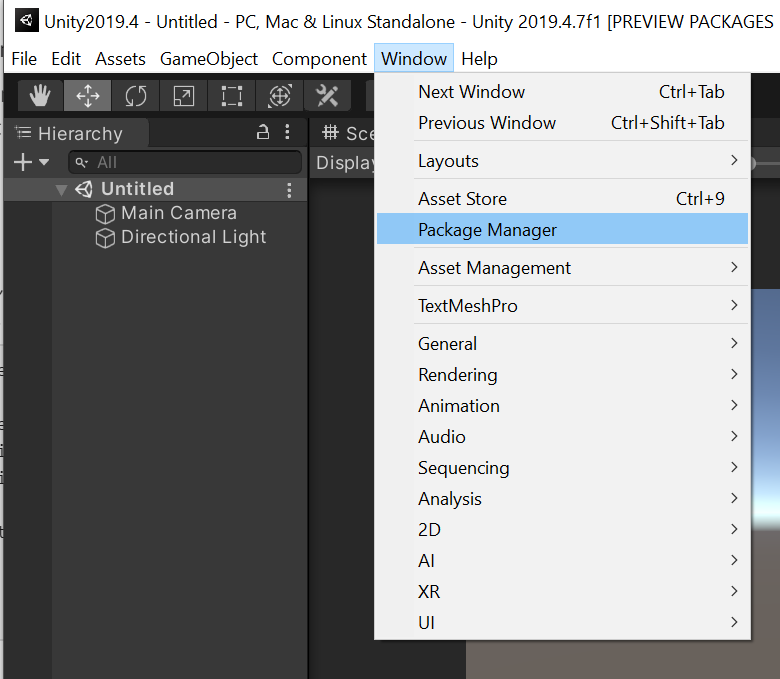
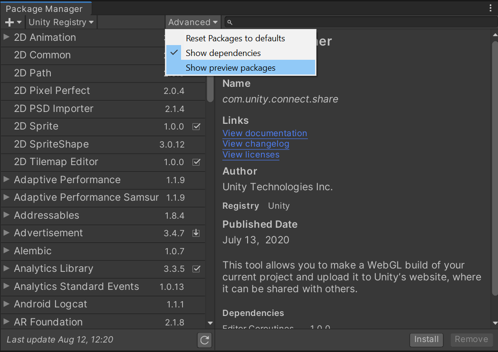
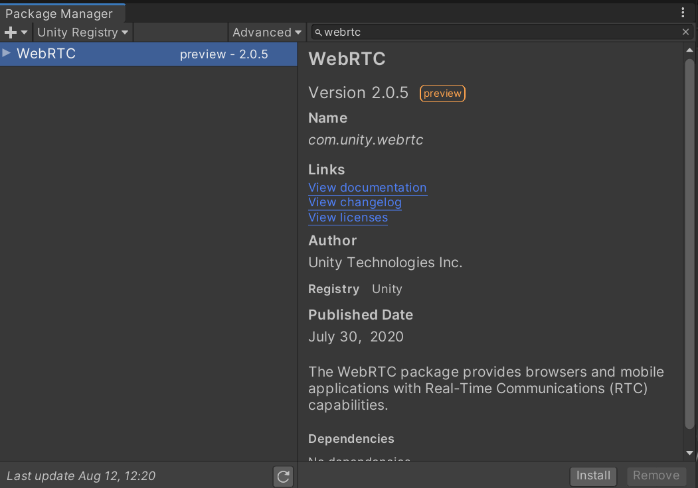

# Install package

> [!NOTE]
> In Unity `2020.3` and `2019.4`, there are differences about how to install WebRTC package so please pay attention to the Unity version you are using and follow the instructions below.

## Case of Unity 2019.4

Select `Window/Package Manager` in the menu bar.



Check Package Manager window, Click `Advanced` button and enable `Show preview packages`.



Input `webrtc` to the search box at the top of the Package Manager window.



Click `Install` button at the bottom left of the window, and will start install the package.

## Case of Unity 2020.3

Select `Window/Package Manager` in the menu bar.


Check Package Manager window, Click `+` button and select `Add package from git URL...`.


Input the string below to the input field.

```
com.unity.webrtc@2.4.0-exp.4
```

The list of version string is [here](https://github.com/Unity-Technologies/com.unity.webrtc/tags). In most cases, the latest version is recommended to use.


 Click `Add` button, and will start install the package.