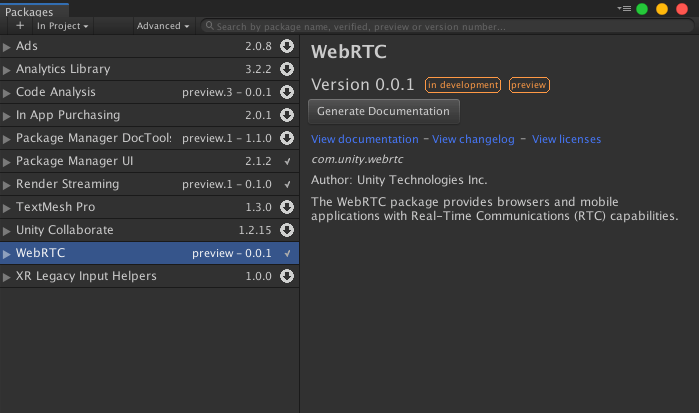

# WebRTC

- [English](../index.md)

**WebRTC for Unity** は、 [WebRTC](https://webrtc.org) を Unity で利用可能にするためのパッケージです。

WebRTC を活用したソリューションのサンプルについては [Unity Render Streaming](https://github.com/Unity-Technologies/UnityRenderStreaming) をご確認ください。

## ガイド

* [チュートリアル](tutorial.md)

## インストール方法
パッケージをインストールするためには、パッケージマネージャから WebRTC for Unity を検索しインストールします。パッケージマネージャの利用方法は[ドキュメント](https://docs.unity3d.com/Packages/com.unity.package-manager-ui@latest/index.html)を参照してください。

## サンプル
パッケージでは以下の3つのサンプルを用意しています。

| シーン名       | 説明                                 |
| -------------- | ------------------------------------ |
| PeerConnection | ピアを接続する手続きを確認するシーン |
| DataChannel    | テキスト送受信を確認するシーン       |
| MediaStream    | ビデオ/音声送受信を確認するシーン    |

## 使用要件

以下のバージョンの Unity Editor で動作を確認しています。

- Unity 2019.1 以降

現在は `windows64` プラットフォームのみサポートしています。

Graphics API は `DirectX11` のみサポートしています。

Scripting Backend の `IL2CPP` は現在のところサポートされていません。

## 制限事項

ビデオエンコーディングにGPUハードウェアアクセラレーションを使用しているため、[NVIDIA VIDEO CODEC SDK](https://developer.nvidia.com/nvidia-video-codec-sdk) 対応のグラフィックスボードでのみ動作します。

## 更新履歴

|Date|Reason|
|---|---|
|June 21, 2019|ドキュメント公開|
