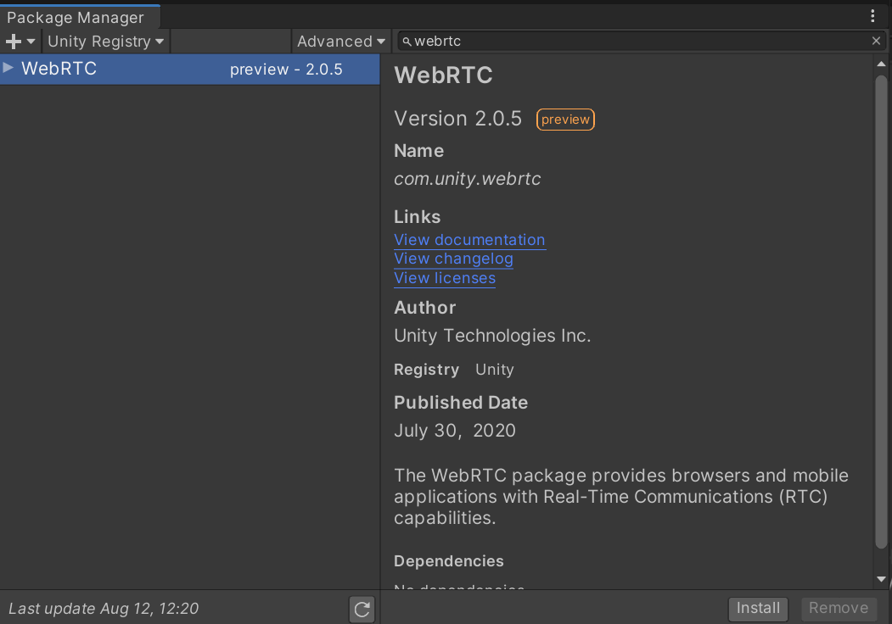
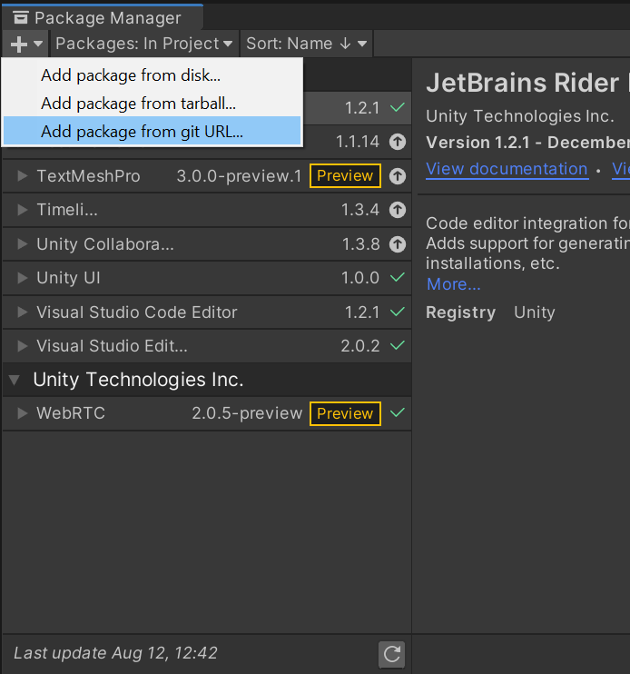

# パッケージのインストール

> [!NOTE]
> Unity 2020.1 と 2019.4 では WebRTC パッケージのインストール方法が異なるため、利用するエディタに応じて、以下の手順に従ってください。

## Unity 2019.4 の場合

メニューバーから `Window/Package Manager` を選択します。


Package Manager ウィンドウに移動し、`Advanced` ボタンをクリックして、`Show preview packages` を有効にします。


Package Manager ウィンドウ上部にある検索ボックスに `webrtc` と入力します。



画面右下の `Install` ボタンを押すと、インストールが開始されます。

## Unity 2020.1 の場合

メニューバーから `Window/Package Manager` を選択します。


Package Manager ウィンドウに移動して、左上の `+` ボタンを押し、`Add package from git URL...` を選択します。



入力ボックスに以下の文字列を追加します。

```
com.unity.webrtc@2.1.0-preview
```

;

`Add` ボタンを押すと、インストールが開始されます。
