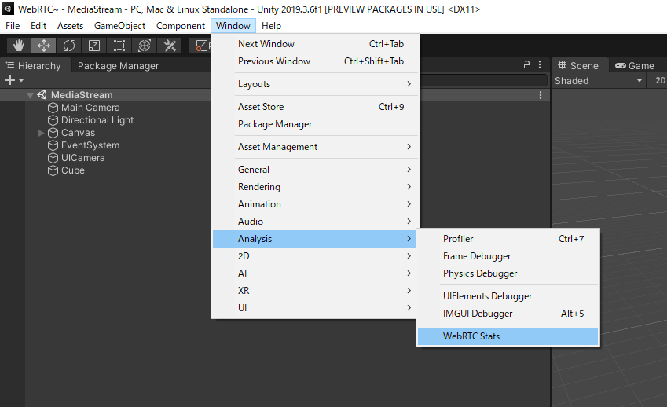
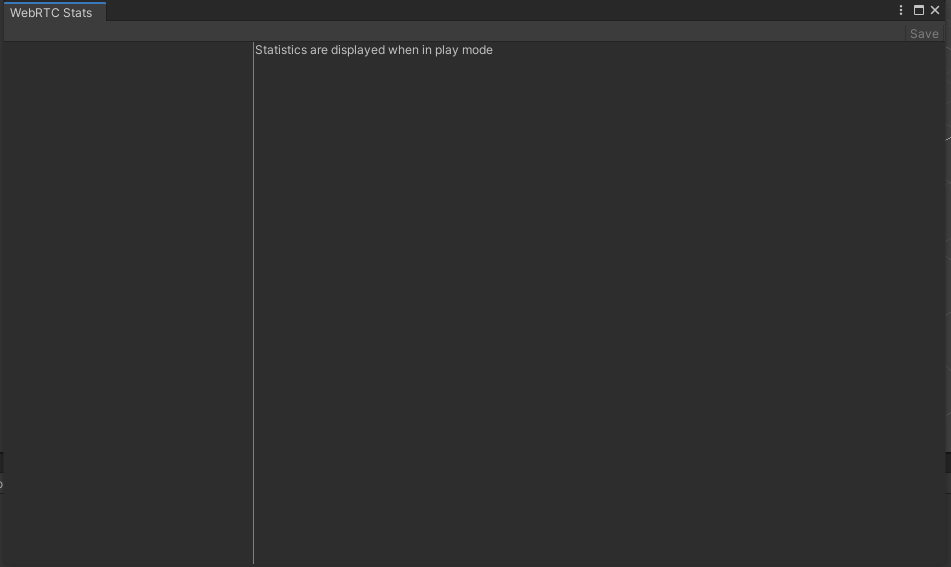

# WebRTC統計情報ツール

Editor限定で、統計情報を表示するツールを用意しています。

## 使用方法

上部ツールバーのWindow -> Analysis -> WebRTC Stats から開くことができます。

開くと下記のような画面が出ます。

PlayModeに入り、PeerConnectionが生成されると自動的に左側にPeerConnectionの一覧が表示されます。
下記は、`MediaStreamSample.unity` にて、`Call` ボタンを押下した段階での画面です。

PeerConnection一覧のボタンを押下すると、対象のPeerConnectionで見れる統計情報一覧がプルダウンメニューとして表示されます。

プルダウンから選択すると下記のような、そのタイプで取得できる情報の一覧が表示されます。
下記は、`CandidatePair` を選択した際の例です。

また、時間によって変化するデータに関してはグラフを用意しています。

## ダンプファイルの作成
収集した統計情報をダンプできるようにしています。
画面の右上にある Save ボタンを押下することによって、ダンプファイルが生成されます。

生成されるダンプファイルは、Chromeの`chrome://webrtc-internals` で生成されるダンプファイルと互換性があります。
