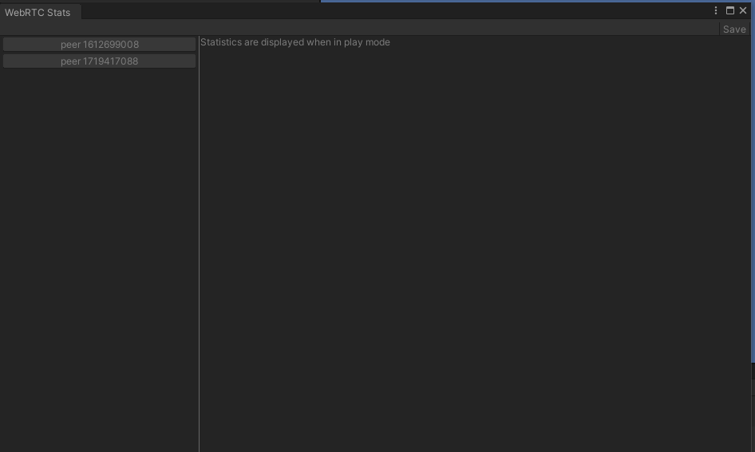
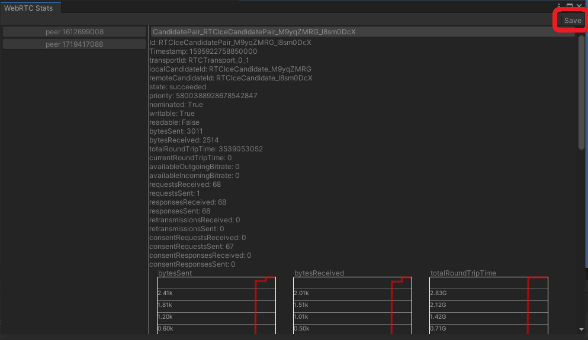

# WebRTC 統計情報ツール

エディタ上で WebRTC に関する統計情報を表示するツールを提供しています。

## 使用方法

上部ツールバーの Window -> Analysis -> WebRTC Stats から開くことができます。

開くと下記のような画面が出ます。

Unity エディタでシーンを実行します。 PeerConnection が生成されると、左側のリストに PeerConnection の一覧が表示されます。

PeerConnection のリスト上にあるボタンを押下すると、対象の PeerConnection の統計情報一覧がプルダウンメニューとして表示されます。

プルダウンから項目を選択すると、統計情報の一覧が表示されます。
下記は `CandidatePair` を選択した際の例です。

また、時間によって変化するデータに関してはグラフを表示します。

## 統計情報の保存
画面の右上にある Save ボタンを押下することによって、収集した統計情報を保存できます。

生成されるダンプファイルは、Chromeの `chrome://webrtc-internals` で生成されるダンプファイルと互換性があるため、サードパーティのアプリケーション上で統計情報を確認することができます。
