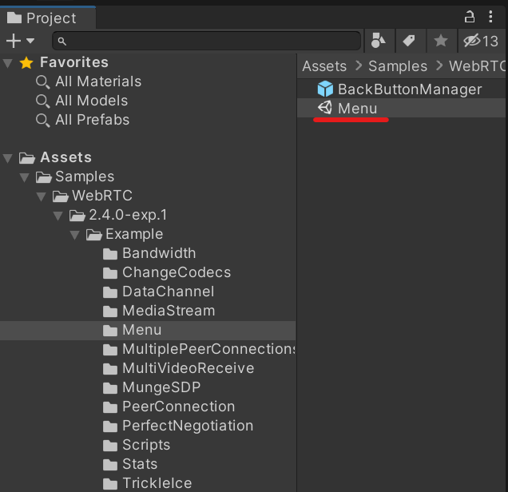
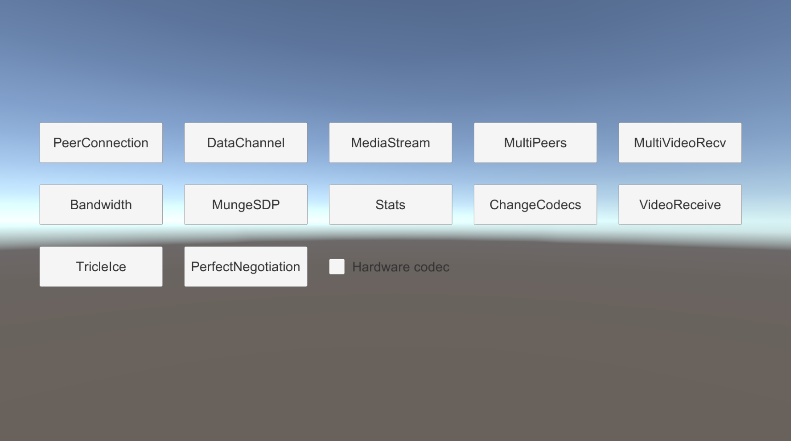
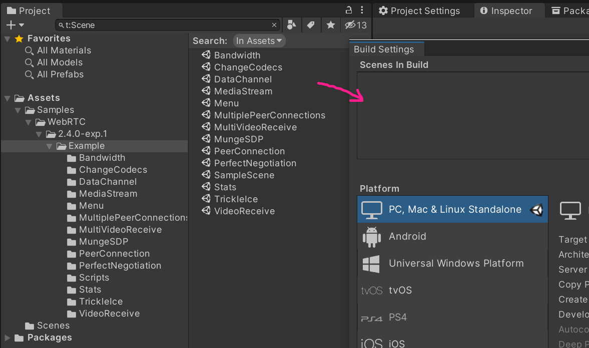
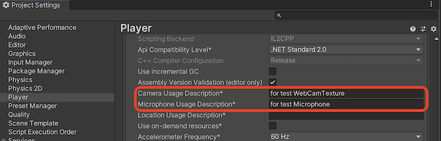

# Samples

The package contains the following samples. 

| Scene | Details |
| ----- | ------- |
| PeerConnection | Checking the process of connecting to a peer |
| DataChannel | Sending and receiving text |
| Audio | Sending and receiving audio stream |
| MediaStream | Sending and receiving video/audio |
| MultiPeers | Instantiating multiple peers and streaming video/audio |
| Stats | Checking the process of getting stats |
| MungeSDP | Checking effects with mungring SDP parameters |
| VideoReceive | Sending and receiving video stream |
| MultiVideoReceive | Receiving multiple video streams with one peer |
| MultiplePeerConnections | Receiving video stream with multiple peers |
| ChangeCodecs | Controlling codecs of the video sender |
| TricleIce | Checking the trickle ICE functionality |
| RestartIce | Checking do an ICE restart |
| PerfectNegotiation | Demonstrating [Perfect Negotiation Pattern](https://developer.mozilla.org/en-US/docs/Web/API/WebRTC_API/Perfect_negotiation) |
| Latency | Measuring a latency of video streaming |
| ReplaceTrack | Change another video track without stopping video streaming |

## Import samples in project

To get these samples, Push the `Import into Project` button on the Package Manager.

## Sample menu

`Menu` scene is helpful for checking multiple sample scenes. You can find the scene `Example/Menu/Menu.scene`.

Open `Menu` scene and press `Play` button, as you can see the menu for sample scenes.

## Install samples into mobile devices 

It's easy to try all samples on mobile devices if only you put sample scenes into `Scenes in Build` in Build Settings Window. `Menu` scene should be loaded as a first one so you need to rearrange scenes.

> [!NOTE]
> If building app for iOS, you need to add description for `CameraUsageDescription` and `MicrophoneUsageDescription` on PlayerSettings.
> `VideoReceive` sample use Camera and Microphone. (If not add description, build is failed.)

