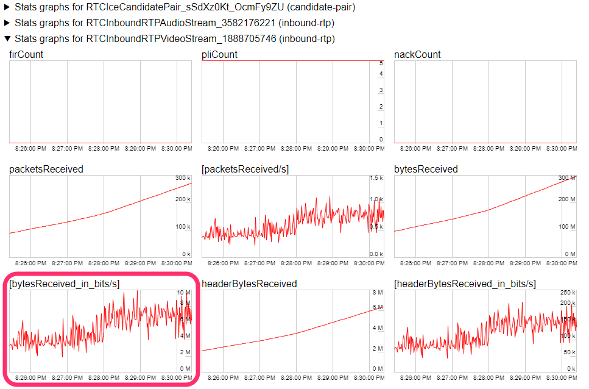

# Video Streaming

WebRTC enables streaming video between peers. It can stream video rendered by Unity to multiple browsers at the same time.

## Codec

### Encode

There are two types of encoder for video streaming, one is using hardware for encoding and one is using software. Regarding different kinds of codecs, the hardware encoder uses `H.264`, and the software encoder uses `VP8`.

We can select the type of encoder by specifying the EncoderType in WebRTC.Initialize's method argument.

```CSharp
// Use a software encoder
WebRTC.Initialize(EncoderType.Software);
```

> [!NOTE]
> This option selects whether or not to use hardware for encoding.
> Currently, there is no way to explicitly designate a codec. 

The major browsers that support WebRTC can use `H.264` and `VP8`, which means most browsers can receive video streaming from Unity.

### Decode

Currently, only SoftwareDecoder can be used, in which case VP8/VP9 can be used as a codec.
In this case, `VP8` or `VP9` can be used as a codec.

> [!NOTE]
> Currently, HardwareDecoder is not supported.
> We plan about HardwareDecoder support in 2.x release.

## <a id="videotrack"/> Video Track

To implement video streaming, create a
 `VideoStreamTrack` instance.

```CSharp
// Create a track from the Camera
var camera = GetComponnent<Camera>();
var track = camera.CaptureStreamTrack(1280, 720);
```

There is also a way to directly assign a `RenderTexture`. 

```CSharp
// Get a valid RendertextureFormat
var gfxType = SystemInfo.graphicsDeviceType;
var format = WebRTC.GetSupportedRenderTextureFormat(gfxType);

// Create a track from the RenderTexture
var rt = new RenderTexture(width, height, 0, format);
var track = new VideoStreamTrack("video", renderTexture);
```

### <a id="add-track"/> Add Track

Add the created video track to the `PeerConnection` instance. The track can be added by calling the `AddTrack` method. Next, call the `PeerConnection`'s `CreateOffer` or `CreateAnswer` to create an SDP.

```CSharp
// Add the track
peerConnection.AddTrack(track);

// Create the SDP
RTCAnswerOptions options = default;
var op = pc.CreateAnswer(ref options);
yield return op;
```

### <a id="multi-track"/> Multi track

It's possible to use multiple video tracks simultaneously. Simply call the `PeerConnection`'s `AddTrack` method multiple times and add the tracks. 

```CSharp
foreach(var track in listTrack)
{
    peerConnection.AddTrack(track);
}
```

When using hardware encoding, the number of tracks that can be used simultaneously may be limited depending on the graphic device's limitations. Generally, on desktop GPUs, up to **two tracks** can be used simultaneously on an NVIDIA Geforce card (On server-grade GPUs this is typically 4). For details, see the [NVIDIA Codec SDK documentation](https://developer.nvidia.com/video-encode-decode-gpu-support-matrix).


See the section on **Streamless tracks** under [`PeerConnection.addTrack`](https://developer.mozilla.org/en-US/docs/Web/API/RTCPeerConnection/addTrack) in the MDN documentation for information on simultaneously receiving multiple tracks in the browser. 

### Bitrate control

To control the bitrate of video streaming, use `SetParameter` method of `RTCRtpSender` instance. The instance of `RTCRtpSender` is obtained from `RTCPeerConnection`.

```CSharp
var senders = peerConnection.GetSenders();
```

Or, obtained from `AddTrack` method as its return value.

```CSharp
var sender = peerConnection.AddTrack(track);
```

After obtained the instance of `RTCRtpSender`, To get the settings about the sending stream, call the `GetParameter` method is able. And call the `SetParameter` method with customized settings. as a result, the settings are reflected.

```CSharp
var parameters = sender.GetParameters();
foreach (var encoding in parameters.Encodings)
{
    encoding.maxBitrate = bitrate;
}
sender.SetParameters(parameters);
```

> [!NOTE]
> Currently not supported `maxFramerate` in values of the settings.
> Also, `scaleResolutionDownBy` parameter only works on software encoder.
>

It is possible to check the current bitrate on browsers. If using Google Chrome, shows statistics of WebRTC by accessing the URL `chrome://webrtc-internals`. Check the graph showing the received bytes per unit time in the category `RTCInboundRTPVideoStream` of statistics.




## Receiving Video

You can use VideoTrack to receive the video.
`VideoTrack` for receiving video is got on `OnTrack` event of the `PeerConnection` instance.
If the type of `MediaStreamTrack` argument of the event is Video, it casts to the `VideoStreamTrack` class.
And call `InitializeReceiver` method, you can get `RenderTexture` that is rendering received video.
You can specify the resolution of the `RenderTexture` on `InitializeReceiver` method.
The received video will be scaled up or down to the resolution of this `RenderTexture`.

```CSharp
var peerConnection = new RTCPeerConnection();
peerConnection.OnTrack = (RTCTrackEvent e) => {
    if (e.Track.Kind == TrackKind.Video)
    {
        var videoTrack = (VideoStreamTrack) e.Track;
        var receiveRender = videoTrack.InitializeReceiver(1280, 720);
    }
    // or
    if (e.Track is VideoStreamTrack videoTrack)
    {
        var videoTrack = (VideoStreamTrack) e.Track;
        var receiveRender = videoTrack.InitializeReceiver(1280, 720);
    }
    // Set RenderTexture to some Image class
};
```

### Receiving multi video

Multiple VideoTracks can be received in a single `PeerConnection`.
It is a good idea to call the `AddTransciver` method on the `PeerConnection` instance as needed track count, and then do signaling.

```CSharp
// call AddTransceiver as needed track count
peerConnection.AddTransceiver(TrackKind.Video);
// Do process signaling
```

### Notes.

- It is not possible to send and receive video in a single `VideoStreamTrack` instance.
- The `VideoStreamTrack` used to receive the video should be the track received in the event of the `PeerConnection.OnTrack`.

