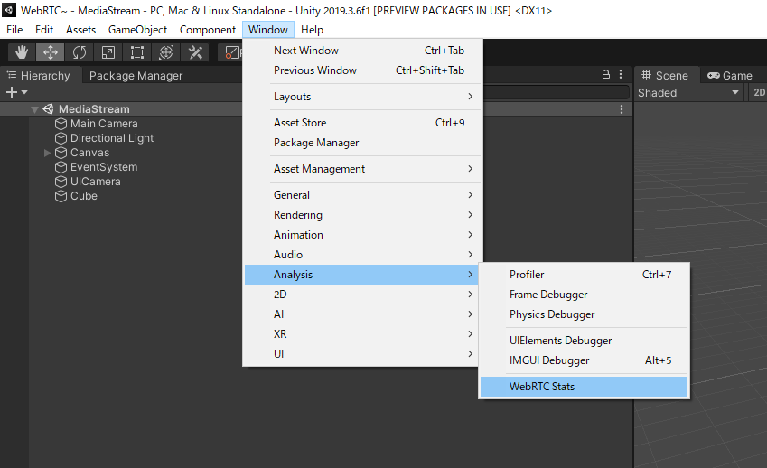
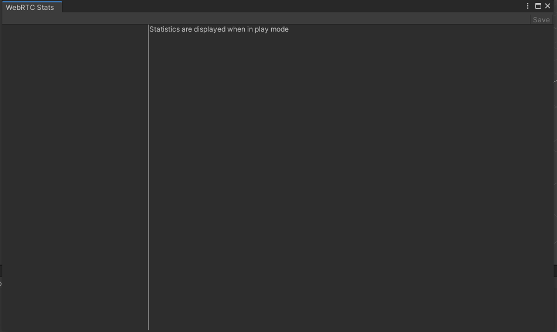
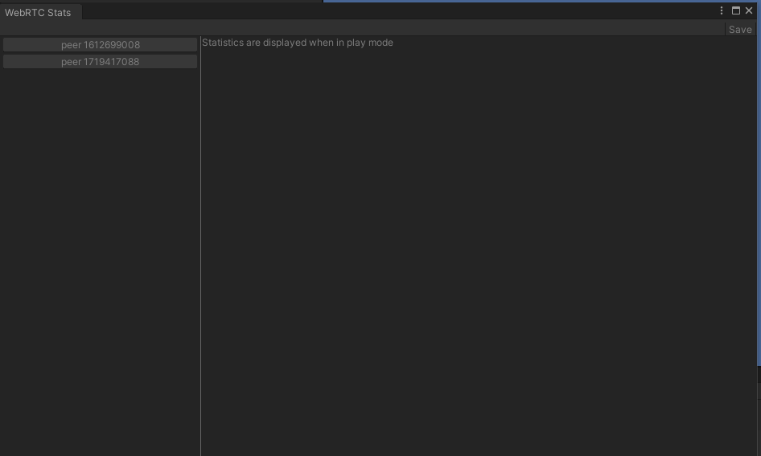
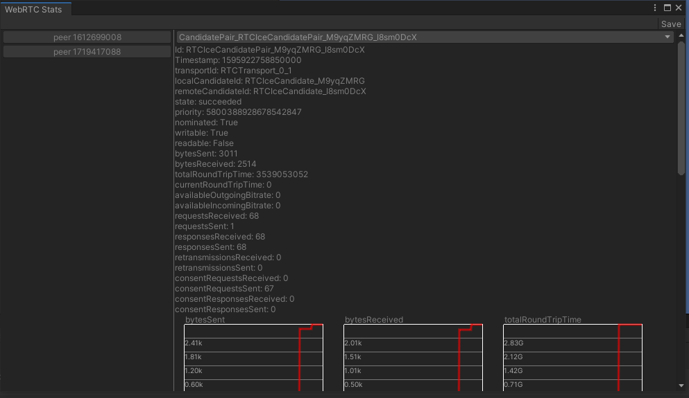
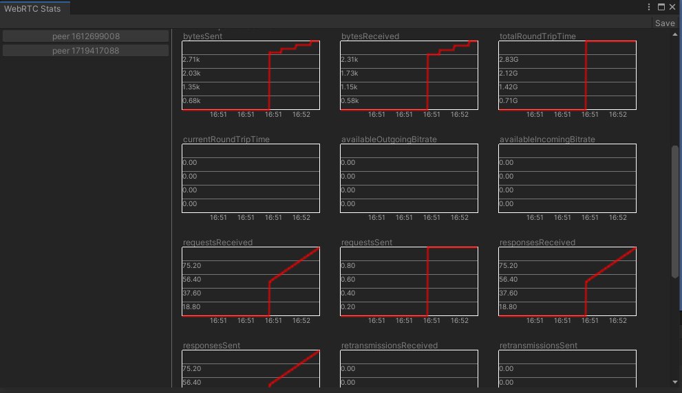
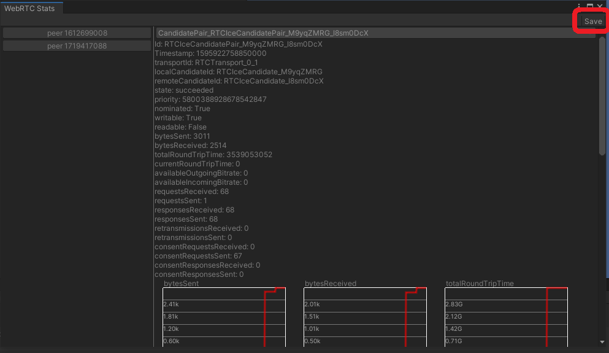

# WebRTC Statistics Tool

Provides a tool to display statistics about WebRTC in the editor.

## How to Use

You can open it from the Window -> Analysis -> WebRTC Stats in the top toolbar.

When you open it, you will see a screen like the one below.

Run the scene in the Unity editor. When the PeerConnection is created, a list of PeerConnections is displayed in the list on the left.

Pressing the button on the list of PeerConnections will display the list of statistics for the target PeerConnection as a pull-down menu.

![WebRTC Stats StatsType List] (images/webrtc-stats_statstypelist.png)

Selecting an item from the pulldown menu displays a list of statistics.
Below is an example when you select `CandidatePair`.

It also displays a graph for data that changes over time.

## Storing Statistics.
You can save the collected statistics by pressing the Save button in the upper right corner of the screen.

The generated dump files are compatible with the dump files generated by Chrome's `chrome://webrtc-internals`, so you can see the statistics in third party applications.
