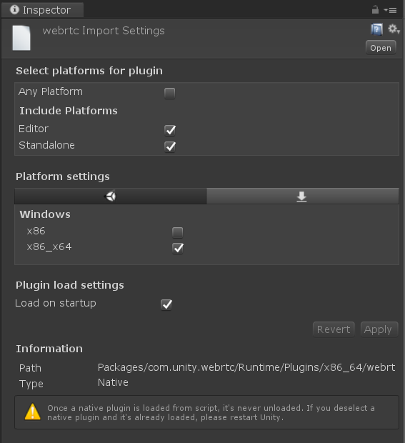
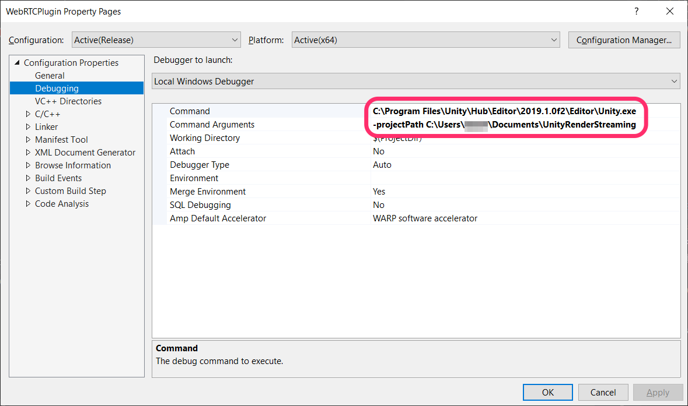

# Build Native Plugin

This guide will cover building and deploying the native plugin `com.unity.webrtc` depends on.

## Developing environment

Install dependencies to make development environment.

### Windows

On windows, [chocolatey](https://chocolatey.org/) is used to install.

```powershell
# Install CUDA
choco install cuda --version=10.1

# Install Windows SDK
# WARNING: If you have versions of Windows SDK earlier than Version 1809,
# compiling the plugin will fail. Make sure to uninstall earlier versions.
choco install -y vcredist2010 vcredist2013 vcredist140 windows-sdk-10-version-1809-all

# Install Vulkan
choco install -y wget
wget https://vulkan.lunarg.com/sdk/download/1.1.121.2/windows/VulkanSDK-1.1.121.2-Installer.exe -O C:/Windows/Temp/VulkanSDK.exe
C:/Windows/Temp/VulkanSDK.exe /S

# Install CMake 3.18.0
choco install cmake -y --version 3.18.0

# Setting up environment variables
setx CUDA_PATH "C:\Program Files\NVIDIA GPU Computing Toolkit\CUDA\v10.1" /m
setx VULKAN_SDK "C:\VulkanSDK\1.1.121.2" /m
```

### Ubuntu

The below commands shows the build process developing environment on Ubuntu `18.04` or `20.04`.

```bash
# Install libc++-dev libc++abi-dev clang vulkan-utils libvulkan1 libvulkan-dev
# Ubuntu `18.04`
sudo apt install -y libc++-10-dev libc++abi-10-dev clang-10 vulkan-utils libvulkan1 libvulkan-dev

# Ubuntu `20.04`
sudo apt install -y libc++-dev libc++abi-dev clang vulkan-utils libvulkan1 libvulkan-dev

# Install freeglut3-dev
sudo apt update
sudo apt install -y freeglut3-dev

# Install CUDA SDK
sudo apt-key adv --fetch-keys http://developer.download.nvidia.com/compute/cuda/repos/ubuntu1804/x86_64/7fa2af80.pub
wget http://developer.download.nvidia.com/compute/cuda/repos/ubuntu1804/x86_64/cuda-repo-ubuntu1804_10.1.243-1_amd64.deb
sudo dpkg -i cuda-repo-ubuntu1804_10.1.243-1_amd64.deb
sudo apt update
sudo apt install -y cuda

# Install CMake 3.18.0
sudo apt install -y libssl-dev
sudo apt purge -y cmake
wget https://github.com/Kitware/CMake/releases/download/v3.18.0/cmake-3.18.0.tar.gz
tar xvf cmake-3.18.0.tar.gz
cd cmake-3.18.0
./bootstrap && make && sudo make install
```

### macOS

On macOS, [homebrew](https://brew.sh/) is used to install CMake. XCode version **11.0.0 or higher** is used but **Xcode 12 would not work well**.

```bash
# Install CMake
brew install cmake
```

### iOS

On macOS, [homebrew](https://brew.sh/) is used to install CMake. XCode version **11.0.0 or higher** is used but **Xcode 12 would not work well**.

### Android

On Ubuntu (**WSL2** on Windows is also working well), 

```bash
# Install Android NDK r21b
wget https://dl.google.com/android/repository/android-ndk-r21b-linux-x86_64.zip

# Set Android NDK root path to `ANDROID_NDK` environment variable
echo "export ANDROID_NDK=~/android-ndk-r21d/" >> ~/.profile

# Install CMake 3.18.0
sudo apt install -y libssl-dev
sudo apt purge -y cmake
wget https://github.com/Kitware/CMake/releases/download/v3.18.0/cmake-3.18.0.tar.gz
tar xvf cmake-3.18.0.tar.gz
cd cmake-3.18.0
./bootstrap && make && sudo make install

# Install pkg-config, zip
sudo apt install -y pkg-config zip
```

## Build plugin

To build plugin, you need to execute command in the `BuildScripts~` folder.

- [BuildScripts~/build_plugin_android.sh](../BuildScripts~/build_plugin_android.sh)
- [BuildScripts~/build_plugin_mac.sh](../BuildScripts~/build_plugin_mac.sh)
- [BuildScripts~/build_plugin_ios.sh](../BuildScripts~/build_plugin_ios.sh)
- [BuildScripts~/build_plugin_linux.sh](../BuildScripts~/build_plugin_linux.sh)
- [BuildScripts~/build_plugin_win.cmd](../BuildScripts~/build_plugin_win.cmd)
    - Note: If you encounter `LNK1120`, `LNK2001` or `LNK2019` errors while running this build script, it's possible that you may need to open `Plugin~/build64/webrtc.sln` and build from within Visual Studio 2019 instead. You can also use it for development. ([#441](https://github.com/Unity-Technologies/com.unity.webrtc/issues/441))

Alternatively, after the script has been run, a project ready for your IDE or other build tools is ready for you to use/build with (the name of the folder differs based on the target platform, check the script for more details).

### Deploying the Plugin

When you run the build, `webrtc.dll` will be placed in `Packages\com.unity.webrtc\Runtime\Plugins\x86_64`. You should then be able to verify the following settings in the Unity Inspector window.

**WARNING:** If "Load on startup" is not ticked, your editor will crash when running your project. This may become unticked after you make a change to the plugin. ([#444](https://github.com/Unity-Technologies/com.unity.webrtc/issues/444))



## Debug

The `WebRTC` project properties must be adjusted to match your environment in order to build the plugin. 

Set the Unity.exe path under `Command` and the project path under `Command Arguments`. Once set, during debugging the Unity Editor will run and breakpoints will be enabled.  


