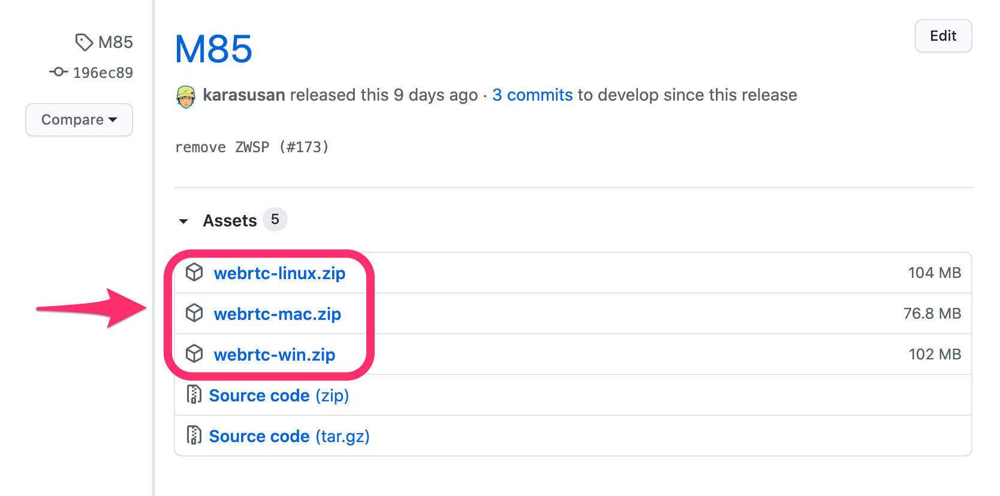
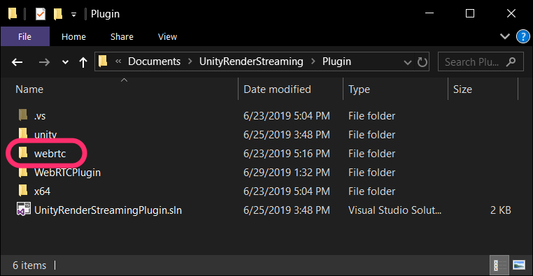
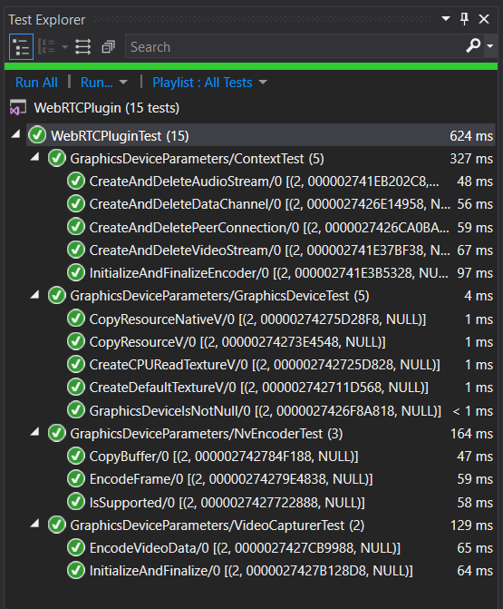

# ネイティブプラグイン

`com.unity.webrtc` はネイティブプラグインを使用しています。
ネイティブプラグインのビルド及び配置方法について説明します。

## 開発環境

開発環境を構築するため、依存ライブラリをインストールします。

### 依存ライブラリのインストール (Windows)

Windows 環境では、インストールに [chocolatey](https://chocolatey.org/) を使用します。

```powershell
# install CUDA
choco install cuda --version=10.1

# install Windows SDK
choco install -y vcredist2010 vcredist2013 vcredist140 windows-sdk-10-version-1809-all

# install Vulkan
choco install -y wget
wget https://vulkan.lunarg.com/sdk/download/1.1.121.2/windows/VulkanSDK-1.1.121.2-Installer.exe -O C:/Windows/Temp/VulkanSDK.exe
C:/Windows/Temp/VulkanSDK.exe /S

# Setting up environment variables
setx CUDA_PATH "C:\Program Files\NVIDIA GPU Computing Toolkit\CUDA\v10.1" /m
setx VULKAN_SDK "C:\VulkanSDK\1.1.121.2" /m

# Install nuget packages
choco install nuget.commandline
nuget restore Plugin~/WebRTCPlugin.sln
```

### 依存ライブラリのインストール (Ubuntu18.04)

Ubuntu18.04 での開発環境の構築手順を以下に示します。

```bash
# Install cmake libc++-dev libc++abi-dev clang vulkan-utils libvulkan1 libvulkan-dev googletest
sudo apt-get install -y libc++-dev libc++abi-dev clang vulkan-utils libvulkan1 libvulkan-dev googletest

# Install CUDA SDK
sudo apt-key adv --fetch-keys http://developer.download.nvidia.com/compute/cuda/repos/ubuntu1804/x86_64/7fa2af80.pub
wget http://developer.download.nvidia.com/compute/cuda/repos/ubuntu1804/x86_64/cuda-repo-ubuntu1804_10.1.243-1_amd64.deb
sudo dpkg -i cuda-repo-ubuntu1804_10.1.243-1_amd64.deb
sudo apt update
sudo apt install -y cuda
```

### 依存ライブラリのインストール (MacOS)

```bash
# Install cmake
brew install cmake

# Install googletest
git clone https://github.com/google/googletest.git
cd googletest
cmake .
make
sudo make install
```

### libwebrtc の組み込み

プラグインは [libwebrtc](https://chromium.googlesource.com/external/webrtc/) に依存しているため、ビルドの際にリンクする必要があります。[Github Release](https://github.com/Unity-Technologies/com.unity.webrtc/releases) にライブラリを配置しています。ライブラリを独自でビルドする場合は、`BuildScript~` フォルダ以下にスクリプトを配置しています。

 

Github Release から該当バージョンの zip ファイルをダウンロードします。
zip ファイルを展開後、`Plugin~` フォルダ直下に配置します。



### プロジェクトの設定

Windows の場合、`WebRTCPlugin.sln` を **Visual Studio 2017** で開いてください。

Linux の場合、 コンパイラに `clang` を使用します。そのため、CLion を利用する際には CMake の設定画面で `clang` の利用を指定します。

Mac OS の場合、コンパイラに `clang` を使用します。以下のコマンドを実行して XCode プロジェクトを作成します。

```bash
cd Plugins~/
cmake -GXcode .
```

`webrtc.xcodeproj` が生成されるので、これを **XCode** で開くことができます。

## デバッグ

プラグインのデバッグを行うためには、個別の環境に合わせ、`WebRTCPlugin` プロジェクトのプロパティを変更する必要があります。

### Visual Studio の場合

Visual Studio の場合、`Debugging` の項目を設定します。`Command` に Unity の実行ファイルパス、`Command Arguments` にプロジェクトパスを指定します。こうすることで、デバッグ実行時に Unity エディタが起動し、ブレークポイントが有効になります。


### ネイティブテスト

ネイティブプラグインの単体テストに [gtest](https://github.com/google/googletest) を使用しています。gtest は多くのプラットフォームで動作し、いくつかの IDE のテストランナーでサポートされているため、プラグインのテストに適しています。

#### Linux の場合
`gtest` を以下のコマンドでインストールします。テストコードに [freeglut](http://freeglut.sourceforge.net/) を使用するため、同様にインストールします。

```
# Install googletest
sudo apt install googletest

# Install freeglut
sudo apt install freeglut3-dev

# Build googletest
cd /usr/src/googletest
sudo cmake -Dcxx_no_rtti=ON \
           -DCMAKE_C_COMPILER="clang" \
           -DCMAKE_CXX_COMPILER="clang++" \
           -DCMAKE_CXX_FLAGS="-stdlib=libc++" \
           CMakeLists.txt
sudo make
sudo cp googlemock/*.a "/usr/lib"
sudo cp googlemock/gtest/*.a "/usr/lib"	           
```

#### Windows の場合
Visual Studio のメニューから `Manage NuGet Packages` を選択して GUI でインストールすることが可能です。
あるいは以下をコマンド実行することでも可能です。

```cmd
choco install nuget.commandline
nuget restore WebRTCPlugin.sln
``` 

Visual Studio を利用している場合は、テストエクスプローラー上でテスト項目を確認できます。



#### Mac の場合

XCode のテストランナーは gtest に対応していません。

## プラグインの配置

ビルドを実行すると、`Packages\com.unity.webrtc\Runtime\Plugins\x86_64` フォルダに以下のファイルを配置します。

| Platform    | Plugin filename      |
| ----------- | -------------------- |
| Windows X64 | `webrtc.dll`         |
| Linux X64   | `libwebrtc.so`       |
| MacOS       | `webrtc.bundle`      |

Unity プロジェクトを開き、Unity のインスペクタ上で以下の設定になっていることを確認してください。`Plugin load settings` がオフの状態だと、正しく動作しない場合があります。


