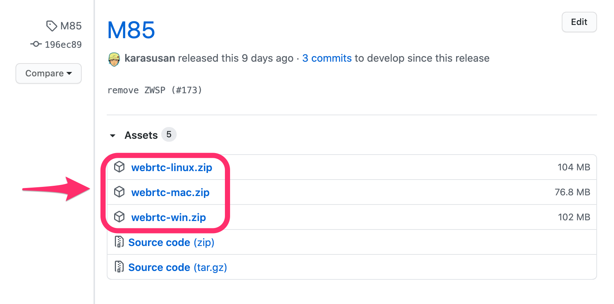
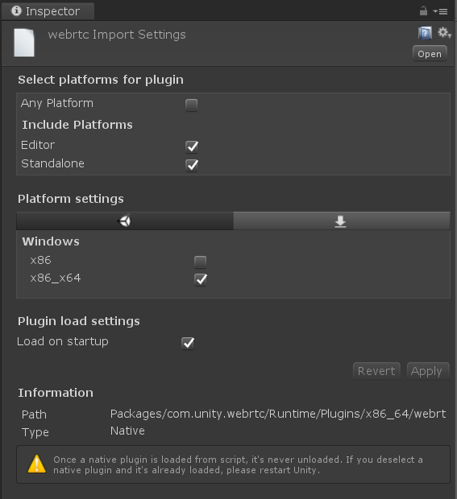

# Native Plugin

This guide will cover building and deploying the native plugin `com.unity.webrtc` depends on.

## Developing environment

Install dependencies libraries to make developing environment.

### How to install dependencies libraries (Windows)

On windows, [chocolatey](https://chocolatey.org/) is used to install.

```powershell
# install CUDA
choco install cuda --version=10.1

# install Windows SDK
choco install -y vcredist2010 vcredist2013 vcredist140 windows-sdk-10-version-1809-all

# install Vulkan
choco install -y wget
wget https://vulkan.lunarg.com/sdk/download/1.1.121.2/windows/VulkanSDK-1.1.121.2-Installer.exe -O C:/Windows/Temp/VulkanSDK.exe
C:/Windows/Temp/VulkanSDK.exe /S

# Setting up environment variables
setx CUDA_PATH "C:\Program Files\NVIDIA GPU Computing Toolkit\CUDA\v10.1" /m
setx VULKAN_SDK "C:\VulkanSDK\1.1.121.2" /m
```

### How to install dependencies libraries (Ubuntu18.04)

The below commands shows the build process developing environment on Ubuntu18.04.

```bash
# Install libc++-dev libc++abi-dev clang vulkan-utils libvulkan1 libvulkan-dev
sudo apt-get install -y libc++-dev libc++abi-dev clang vulkan-utils libvulkan1 libvulkan-dev

# Install CUDA SDK
sudo apt-key adv --fetch-keys http://developer.download.nvidia.com/compute/cuda/repos/ubuntu1804/x86_64/7fa2af80.pub
wget http://developer.download.nvidia.com/compute/cuda/repos/ubuntu1804/x86_64/cuda-repo-ubuntu1804_10.1.243-1_amd64.deb
sudo dpkg -i cuda-repo-ubuntu1804_10.1.243-1_amd64.deb
sudo apt update
sudo apt install -y cuda
```

### How to install dependencies libraries (MacOS)

TBD.


### Embedding libwebrtc

The plugin relies on [libwebrtc](https://chromium.googlesource.com/external/webrtc/), so building it requires a static libwebrtc link. `webrtc-win.zip` can be found on the [Github Release](https://github.com/Unity-Technologies/com.unity.webrtc/releases) page. If you want to build the library yourself, build script can be found below `BuildScript~` folder.

 

Download the zip on Github Release page.
Extract the files from the zip, and place them in the `Plugin~` folder.


### Project Settings

On Windows, open `WebRTCPlugin.sln` with **Visual Studio 2017**. 

On Linux, `clang` is used as compiler. For the reason, when using CLion `clang` is specified on CMake settings dialog.

### Debug

The `WebRTCPlugin` project properties must be adjusted to match your environment in order to build the plugin. 

Set the Unity .exe path under `Command` and the project path under `Command Arguments`. Once set, during debugging the Unity Editor will run and breakpoints will be enabled.  


### Unit testing

[gtest](https://github.com/google/googletest) is used for Unit testing of native plugin.

#### On Linux

`gtest` is installed by these command below. As test code depends on [freeglut](http://freeglut.sourceforge.net/) is needed to install. 

```
# Install googletest
sudo apt install googletest

# Install freeglut
sudo apt install freeglut3-dev

# Build googletest
cd /usr/src/googletest
sudo cmake -Dcxx_no_rtti=ON \
           -DCMAKE_C_COMPILER="clang" \
           -DCMAKE_CXX_COMPILER="clang++" \
           -DCMAKE_CXX_FLAGS="-stdlib=libc++" \
           CMakeLists.txt
sudo make
sudo cp googlemock/*.a "/usr/lib"
sudo cp googlemock/gtest/*.a "/usr/lib"	           
```

#### On Windows
`gtest` can be installed from the `Manage NuGet Packages` menu on Visual Studio. Or can get by executing commands below. 

```cmd
choco install nuget.commandline
nuget restore WebRTCPlugin.sln
``` 

#### On Mac OS

TBD.

### Deploying the Plugin

When you run the build, `webrtc.dll` will be placed in `Packages\com.unity.webrtc\Runtime\Plugins\x86_64`. You should then be able to verify the following settings in the Unity Inspector window. 



